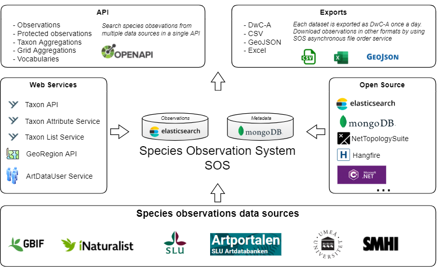
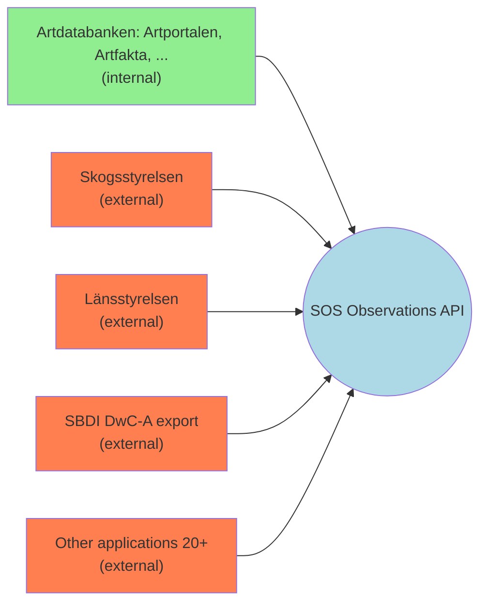

# Species Observation System (SOS)
Species Observation System collects species observations from a number of data sources and gives the user an opportunity to search for those observations using a single API. The system contains over 100 million species observations.

## Branching strategy
We use trunk based development as explained [here](TrunkBasedBranchingStrategy.md). 

## Access the API

### External users
Go to [Artdatabanken developer portal](https://api-portal.artdatabanken.se/) and subscribe to the [Species Observations - multiple data resources](https://api-portal.artdatabanken.se/products/sos) product. Then you will get a description of all endpoints and you will also get an API key to use in your requests.

### Internal applications at SLU
- [SOS Observations API - Swagger UI](https://sos-search.artdata.slu.se/swagger/index.html)
- [SOS Analysis API - Swagger UI](https://sos-analysis.artdata.slu.se/swagger/index.html)

## API usage documentation
- [Search filter parameters](SearchFilter.md)

## API consumers

