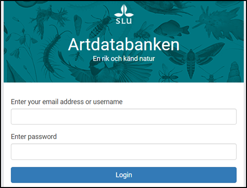

# Authentication
If your application need access to protected species, you need to login with your Artdatabanken (Artportalen) user account to get an access token.
 SOS supports OAuth 2.0.

## Security

| Name 	| Value 	|
|-	|-	|
| OAuth 2.0 Server 	| https://ids.artdatabanken.se 	|
| Scope 	| SOS.Observations.Protected openid 	|
| Auth URL 	| https://ids.artdatabanken.se/connect/authorize 	|
| Access token URL 	| https://ids.artdatabanken.se/connect/token 	|
| Login URL 	| https://ids.artdatabanken.se/account/login 	|

## Client
Every client that needs login functionality, must be added to Artdatabanken identity server. Contact support if needed.

