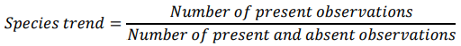

# Checklists
SOS has support for [Artportalen checklists](https://www.artportalen.se/Home/ChecklistInfo) and [Swedish national forest inventory vegetation data (Riksskogstaxeringens vegetationsdata) checklists](https://www.slu.se/riksskogstaxeringen).

## Endpoints
The following endpoints exist (2022-05-27):

### GetChecklistById
Get checklist by EventId.

### CalculateTrend
The trend for a specific species is calculated with the following formula:

