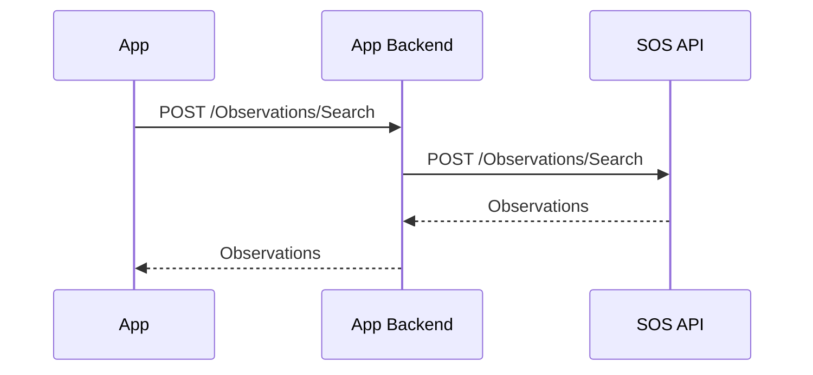

# SOS Client Development
This document contains some basic information about SOS and tips on what to consider when developing a consumer of the SOS API.

## Basics
Regardless of whether you are developing a web, app or desktop solution, it is best practice to communicate with SOS through a dedicated backend and not access the API directly from the web browser or phone app. This way, you only need to make changes in one place, the App Backend, if there are structural changes in the SOS API.



## Case sensitivity
Use "case insensitive" when deserializing JSON data from SOS. This prevents errors that can be difficult to identify.
```csharp
var jsonSerializerOptions = new JsonSerializerOptions {
  PropertyNameCaseInsensitive = true
};
```


## Null values

### Requests
Instead of setting JSON properties to `null` or empty object/array, you can omit the property entirely. This reduces the amount of data being sent and simplifies troubleshooting, as it becomes easier to identify the relevant parts.

### Responses
The SOS API uses `DefaultIgnoreCondition = JsonIgnoreCondition.Never` which means that nullable properties will be serialized as `null` (with some exceptions explained below).
```csharp
var jsonSerializerOptions = new JsonSerializerOptions {
  DefaultIgnoreCondition = JsonIgnoreCondition.Never
  PropertyNameCaseInsensitive = true  
};
```

**Example**
```json
{
  "propertyWithValue": "My value"
  "propertyWithoutValue": null
}
```


### Observation endpoints
The SOS system uses **Elasticsearch** as search database for Observations, Events and Datasets. Elasticsearch doesn't store null values, and since the SOS API allows you to specify what fields you want to return, properties with null values will be omitted in the response.

**Request**
`POST /Observations/Search`
```json
{
  "output": {
    "fields": ["event.startDate", "event.plainStartDate", "event.plainStartTime"]
  }
}
```

**Response - When the nullable field *plainStartTime* contains a value**
```json
{
  "event": {
    "startDate": "2017-04-25T18:35:00+02:00",	  
    "plainStartDate": "2017-04-25",	  
    "plainStartTime": "18:35"  
  }
}
```

**Response - When the nullable field *plainStartTime* is null**
```json
{
  "event": {
    "startDate": "2017-04-25T00:00:00+02:00",	  
    "plainStartDate": "2017-04-25"	  
  }
}
```

### Export endpoints
When exporting observations to CSV, Excel and GeoJSON a flat observation structure will be used in where null values will be included by default.

**Request**
`POST Exports/Download/GeoJSON`
```json
{
  "output": {
    "fields": ["event.startDate", "event.plainStartDate", "event.plainStartTime"]
  }
}
```

**Response**
```json
{
  "properties": {
    "StartDate": "2017-04-25T00:00:00+02:00",	  
    "PlainStartDate": "2017-04-25",
    "PlainStartTime": null
}
```

**Request with excludeNullValues=true**
Explicitly exclude null values
`POST Exports/Download/GeoJSON?excludeNullValues=true`
```json
{
  "output": {
    "fields": ["event.startDate", "event.plainStartDate", "event.plainStartTime"]
  }
}
```

**Response**
```json
{
  "properties": {
    "StartDate": "2017-04-25T00:00:00+02:00",	  
    "PlainStartDate": "2017-04-25"    
}
```


## Headers
When calling SOS, you can include certain values in the request headers. In many cases, this is not necessary, but for certain functionality, it is required to include correct information, and in other cases, it simplifies troubleshooting, for example. Below, you can read about different values that can be included in your requests.

### X-Requesting-System
In this header, you specify the system that is making the call to SOS. With this information, it becomes easier for us to assist you in troubleshooting if you encounter any issues with a query.

### X-Authorization-Application-Identifier
If you have authorization associated with a specific application within SLU, you can specify it here so that the returned data is based on the permissions you have in the respective application.

### X-Authorization-Role-Id
If you have authorization associated with a role in SLU's authorization system, you provide the ID of the role so that the returned data reflects the permissions of that role.

### X-Api-Version
This header is for future version control of SOS. You don't need to specify any value for now.


## Resource Grouping
The SOS API is divided into different resource groups to group related functionality. Currently, the following resource groups are available.

### Areas
Areas are used to define different geographical regions. Municipality, county, and parish are examples of different areas used by SOS.

### DataProviders
Information about the different data providers for SOS can be found under DataProviders.

### Environment
Environment describes the current environment in which SOS is operated.

### Exports
SOS is a REST API and is not intended to be used as a data source for bulk downloads. If you are interested in large data sets, we recommend using exports. There are pre-built datasets available in DwC-A format for all DataProviders, and you can also define custom queries to download larger datasets in various formats. Currently, you can directly generate files with up to 100,000 observations. If you need more data, you can request files with up to 2,000,000 observations.

### Jobs
When placing a file order, you receive a job ID as a receipt. This ID can be used to check the status of the job that generates the file.

### Locations
Information about occurrence locations can be found under Locations.

### Observations
Occurrence related data is found under Observations. Here, you can search for occurrences or use any of the available aggregated resources.

#### Filter
Some resources allow you to specify which fields you want to retrieve. You can specify a predefined field set (fieldset) (see more under Vocabularies below), or you can also specify exactly what you want to retrieve. By using this functionality, you minimize network traffic and optimize query performance. When specifying the fields you want to return, it's important to use the same format as they are returned. For example, if you want to return the start date of an observation, you would specify "event.startDate" in the output.fields. It is possible to specify a fieldset and supplement it with individual fields.

### Systems
If you want to know more about when the SOS database was last updated or how many observations are in the database, this is where you should look.

### TaxonLists
Lists of red-listed species, indicator species, or other groupings can be found under TaxonLists. The IDs of the lists can be used in certain searches.

### User
If you include a Bearer Authentication token in your requests, you can use this resource to see the roles and permissions of the user.

### Vocabularies
Swedish and English are the languages supported by SOS for metadata currently. The vocabulary used by SOS can be downloaded here. There are also resources available to display project information and more regarding the field sets that can be used in SOS.

## Versioning
Managing multiple versions of an API is complex and costly, so we strive to make all changes backward compatible. We follow [DIGG's guidelines](https://dev.dataportal.se/rest-api-profil/versionhantering)) on what is considered backward compatible changes.

*An API should, as far as possible, have a loose coupling between the producer and the consumer. Therefore, backward compatibility is an important aspect of an API. With a backward-compatible API, changes can be made to the API without affecting the consumer of the API.*

*The following are examples of types of changes considered backward-compatible:*
- *Addition of a new optional field to a representation.*
- *Addition of a new resource for an API.*
- *Addition of a new optional search parameter.*
- *Additional support for media types.*
- *Removal of non-mandatory fields from representations.*

*The following are examples of types of changes considered non-backward-compatible:*
- *Removal of mandatory fields from representations.*
- *Change of data type for a field.*
- *Removal of resources or operations.*
- *Removal of support for media types.*

*As a producer of an API, one SHOULD avoid introducing non-backward compatible changes in their API, although sometimes it is unavoidable. As a consumer, one SHOULD always be tolerant, expect, and handle unexpected responses in a message. This creates robustness.*


# Mats text

# Sammanfattning

Det här dokumentet innehåller lite grundläggande angående SOS och tips på vad som är bra att tänka på om man utvecklar en konsument av data från systemet.

# Grundläggande

Oberoende om man utvecklar en webb eller klientbaserad lösning är det ”best practice” att man kommunicerar med SOS via en egen back-end. På så sätt behöver man bara ändra på ett ställe om det blir strukturella förändringar i framtiden.

Använd ”case insensitive” vid serialisering av json-data från SOS. Det förhindrar fel som kan vara svåra att hitta.

Istället för att sätta json-properties till null eller tom/t object/array, kan man utelämna propertyn helt. Det medför att man skickar mindre data och det förenklar vid eventuell felsökning då det blir lättare att se de relevanta delarna.

## Headers

När man anropar SOS så kan man skicka med vissa värden i headern på anropet. Detta är i många fall inte nödvändigt, men för viss funktionalitet krävs det att korrekt information finns med och i andra fall förenklar det till exempel felsökning. Nedan kan du läsa lite om olika värden man skicka med i sina anrop.

### X-Requesting-System

I den här headern anger man vilket system det är som anropar SOS. Med hjälp av den informationen är det lättare för oss att hjälpa er att felsöka om ni får problem med en fråga

### X-Requesting-System

Denna header är för framtida versionshantering av SOS

### X-Authorization-Application-Identifier

Om man har behörighet kopplad till en viss applikation inom SLU, kan man ange det här för att returnerad data ska baseras på de rättigheter man har i aktuell applikation.

### X-Authorization-Role-Id

Om man har behörighet kopplad till en roll i SLU’s behörighetssystem så anger man ID’et på rollen för att returnerat data ska spegla rollens behörighet.

# Resursgruppering

SOS API är uppdelat i olika resursgrupper för att gruppera närliggande funktionalitet. I nuläget finns följande resursgrupper.

## Areas

Areor används för att definiera olika geografiska områden. Kommun, län och socken är exempel på olika områden som SOS använder.

## DataProviders

Information om de olika leverantörerna av data till SOS kan man hitta under DataProviders.

## Environment

Environment beskriver aktuell miljö som SOS driftas i.

## Exports

SOS är ett REST-API. Det är inte tänkt att användas som datakälla för att ”tanka” ner allt. Ar man intresserad av stora datamängder hänvisar vi er till exporter. Dels finns det färdiga data-set i DwC-A format att ladda ner för alla DataProviders, men man kan också definiera egna frågor för att tanka hem större datamängder i olika format. I nuläget kan man direkt-generera filer med upp till 100 000 observationer. Behöver man data än så kan man beställa filer med upp till 2 000 000 observationer.

## Jobs

Om man gör en filbeställning så får man ett jobb-ID som kvittens när man gör sin beställning. Detta ID kan man använda för att se vilken status jobbet som genererar filen är i.

## Locations

Information om fyndplatser hittar man under Locations

## Observations

Fyndrelaterad data återfinns under Observations. Här kan man söka efter fynd eller använda någon av de aggregerade resurserna som finns.

### Filter

Vissa resurser tillåter att man anger vilka fält man vill ha tillbaka. Dels kan man ange en fördefinierad fältuppsättning (fieldset) (se mer under Vocabularies nedan), men man kan även specificera exakt vad man vill ha tillbaka. Genom att använda denna funktionalitet minimerar man trafiken på nätverket och optimerar prestandan på sina frågor. När man anger vilka fält man vill returnera är det viktigt att man anger dem med på samma sätt som de returneras. Vill man t.ex. returnera startdatum för en observation så anger man ”event.startDate” i output.fields. Det är möjligt att ange ett fieldset och komplettera med enskilda fält.

## Systems

Vill man veta mer om när SOS-databasen uppdaterades, eller hur många observationer som finns i databasen är det här man ska titta.

## TaxonLists

Listor med rödlistade arter, signalarter eller andra grupperingar kan man hitta under TaxonLists. ID’n på listor kan användas i vissa sökningar.

## User

Om man skickar med en Bearer Authentication token i sina anrop, kan man använda denna resurs för att se vilka roller och behörigheter användaren har.

## Vocabularies.

Svenska och engelska är de språk som SOS stödjer för meta data i nuläget. Den ordlista som SOS använder går att ladda ner här. Det finns även resurser för att visa projektinformation och mer gällande de fältuppsättningar som går att använda i SOS.