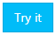
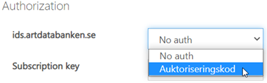
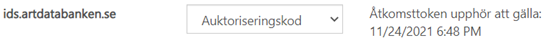
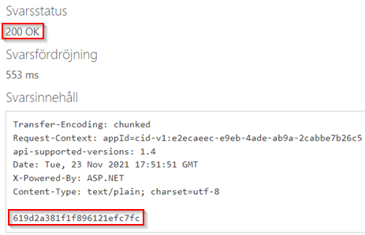
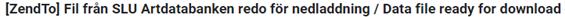

# Exports
The supported file formats in exports are: CSV, GeoJSON, Excel and Darwin Core Archive (DwC-A).

## Endpoints
| Resource URL | Name | Method | Description |
|:---|:---|:---|:---|
| /Exports/Datasets 	| Exports_GetDatasetsList 	| GET 	| Get a list of data provider datasets (DwC-A) available for download. 	|
| /Exports/Download/Csv 	| Exports_DownloadCsv 	| POST 	| Download Csv export file. The limit is 25 000 observations. If you need to download more observations, use the OrderCsv endpoint. 	|
| /Exports/Download/GeoJson 	| Exports_DownloadGeoJson 	| POST 	| Download GeoJson export file. The limit is 25 000 observations. If you need to download more observations, use the OrderGeoJson endpoint. 	|
| /Exports/Download/Excel 	| Exports_DownloadExcel 	| POST 	| Download Excel export file. The limit is 25 000 observations. If you need to download more observations, use the OrderExcel endpoint. 	|
| /Exports/Download/DwC 	| Exports_DownloadDwC 	| POST 	| Download DwC-A export file. The limit is 25 000 observations. If you need to download more observations, use the OrderDwC endpoint. 	|
| /Exports/Order/Csv 	| Exports_OrderCsv 	| POST 	| Starts Csv aynchronous file order. When the file is ready, you will receive an email containing a download link. The limit is 2 million observations. |
| /Exports/Order/GeoJson 	| Exports_OrderGeoJson 	| POST 	| Starts GeoJSON aynchronous file order. When the file is ready, you will receive an email containing a download link. The limit is 2 million observations. |
| /Exports/Order/Excel 	| Exports_OrderExcel 	| POST 	| Starts Excel aynchronous file order. When the file is ready, you will receive an email containing a download link. The limit is 2 million observations. |
| /Exports/Order/DwC 	| Exports_OrderDwC 	| POST 	| Starts DwC-A aynchronous file order. When the file is ready, you will receive an email containing a download link. The limit is 2 million observations. |

## Parameters
| Name | Description | Applies to |
|:---|:---|:---|
| description 	| A description of your download. Will be displayed in the email. 	| GeoJSON, CSV, Excel, DwC-A	|
| cultureCode 	| The culture code used for translation of [vocabulary values](Vocabularies.md).	| GeoJSON, CSV, Excel |
| outputFieldSet 	| The observation property [field set](FieldSets.md). 	| GeoJSON, CSV, Excel |
| propertyLabelType 	| The label (column header) type to use. Use one of the following: - PropertyName (StartTime) - PropertyPath (Event.StartTime) - Swedish (Starttid) - English (Start time) 	| GeoJSON, CSV, Excel |
| flat 	| If false, the observations will use the same hierarchical JSON structure as describe on the [Observation page](Observation.md).	| GeoJSON |
| excludeNullValues 	| Exclude properties with null values.	| GeoJSON |

## How to create an asynchronous file order export using SLU Artdatabanken developer portal

1. Create the search filter you want to use. Use the [search filter documentation page](SearchFilter.md) for reference.
2. Make sure the number of observations is less than 2 million by making a request to the /Observations/Count endpoint. You can use the [SLU Artdatabanken developer portal](https://api-portal.artdatabanken.se/docs/services/sos-api-v1/operations/Observations_Count) to make the request.
3. Go to the /Exports/Order/\{format\} endpoint you want to use. For example [/Exports/Order/GeoJson](https://api-portal.artdatabanken.se/docs/services/sos-api-v1/operations/Exports_OrderGeoJson). Click the "Try it" button. 
  
4. Authorize using your SLU Artdatabanken (Artportalen) account. You will then get an access token: 
    
  Will look like this when authorization is done: 
  
5. Make the request by pressing Skicka (Send). You will then get a HTTP 200 response code and a jobId. 
 
6. You can use the /Jobs/\{jobId\}/Status endpoint to check the status of your file order.
7. When the file is ready you will get a mail with the following subject: 
    
   The mail contains a download link.