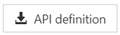
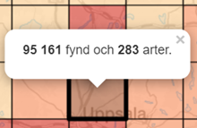
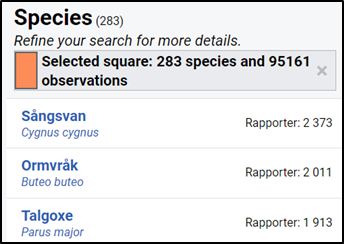

# FAQ
This page provides information about frequently questions or concerns.

### How do I get access to the API?
Go to [Artdatabanken developer portal](https://api-portal.artdatabanken.se/) and subscribe to the [Species Observations - multiple data resources](https://api-portal.artdatabanken.se/products/sos) product. Then you will get a description of all endpoints and you will also get an API key to use in your requests.

### Where can I find detailed documentation of the API schema?
Go to [Artdatabanken developer portal](https://api-portal.artdatabanken.se/) and to the [Species Observations - multiple data resources](https://api-portal.artdatabanken.se/products/sos) product.
There you can download Open API 3 Specification for the API.

### How do I pass my API subscription key in a request?
Subscription key can be passed either in the header or in the URL query parameter. Header is checked first. Query parameter is checked only if the header is not present. Header name should be `ocp-apim-subscription-key`. Query parameter name should be `subscription-key`.

### I want to download more than 10 000 observations. How to do that?
For technical and performance reasons there is a hard limit for the search endpoints of 10 000 records. Each page is limited to a maximum size of 1000 records per page. You will get an error if the skip + take exceeds 10 000.
To retrieve up to 2 million records, you should use the [asynchronous file order (exports) endpoints](Exports.md). You can also try:
- Use a more specific search filter.
- Download all observations (except protected) as DwC-A by using the `Exports_GetDatasetsList` endpoint.
- Use the `Observations_GeogridAggregation` or `Observations_TaxonAggregation` endpoints to aggregate by grid cells and taxa. The [Observation maps application](https://fyndkartor.artfakta.se/) is a great example that uses this strategy when the number of observations exceeds 10 000.

##### Geogrid aggregation

##### Taxon aggregation

