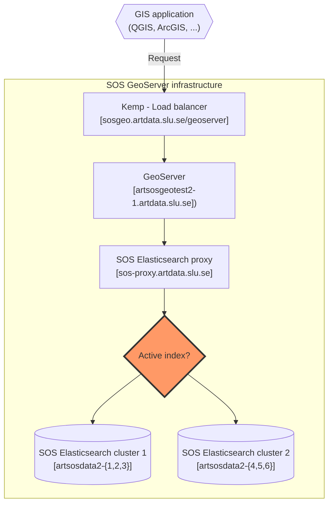

# GeoServer infrastructure
This page provides information about SOS GeoServer infrastructure.

## Infrastructure - diagram
Infrastructure diagram using embedded mermaid syntax.

## Infrastructure - image
Infrastructure diagram using mermaid server.

[](https://mermaid.live/edit#pako:eNqVk21vmzAQx7-K5apSIwFVYKtUNnWKlqqaNu2Jvgt54dhHsWYws02bKOO773gIyVg7abyA8z387rg_7CnXAmhMM6WfeM6MI_fLtCR4nZ-Tzxiz_elO2kVV7fcpvfuQEFZVSnLmpC7fbszlzcU39HpkYXj3DIJgltKm6Us_QlGtUto-iE8-aSbIhilWcjBd8cpq-wA6wOaCORZYVQcWLtFlwTyCWad0PQwBOulciBvtnoHFPcaBdaE_n9DWsxGSaIu1X43e7hCTfEnIrWLWSW6BGZ6Tqo2Mg_ndcUo7hb1XtXVglsClxX3ghhbcyUcgshSwfYd7GFOHRkPFfHXxXH_eR8n89MXa5qG_n3uhFzXYfrZ-ARr-Gxo-A33lvfauemiLTMtR_--gOo3_-AaI79-QXxj7WeOq0eqE7Qrbu603D4ZVOWmHGEXCZWQGBzI1d7WB44fR0Y5pE5276Ilgfyl4SJiIEMexGMyXdDpUTjT5v_SwT4dSkOHqHUcLt5i4nQJ7dHFE2CVk5DAiyaRS8Vl2feXhhvQPiM-iKBps_0kKl8dRtX1DPVqAKZgU-MPuW1hKXQ4FpDRGU0DGauVSmpYNptYV6gu3QjptaIybB4-y2ulkV_LDuc9ZSoaSFTTOmLLQ_AZ1zlu5)
