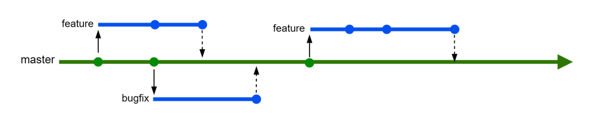
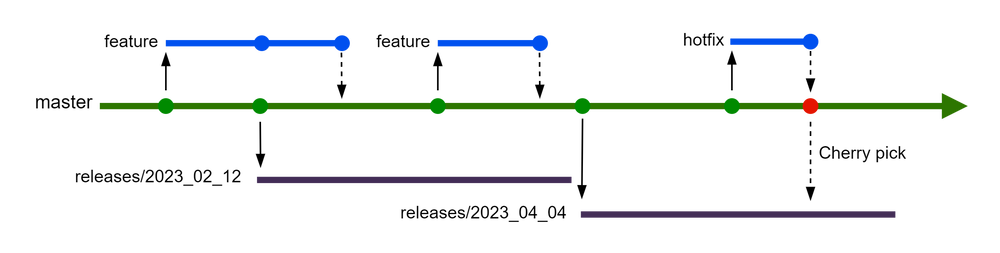

# Trunk Based Development and Releases

Trunk based development is a software development practice where all developers work on a single main branch, typically called the "trunk" or "main" branch. The goal is to make small, simple changes and quickly integrate them into the main branch to reduce the likelihood of merge conflicts and catch issues early in the development process. Automated tests are run on the entire codebase to ensure that changes do not break existing functionality.

## Branching
If you want to add a feature or fix a bug, you should create a branch, add the feature or fix the bug, get it merged into the master branch, and then delete the branch.

**What if I'm not done with a feature?** 
That's where you use feature flags. Keep your features isolated from your end users until you're ready to release them by using feature flags.

## Releases
When releasing a new version to production, we create a new branch based on the master branch. In our case, we name it by the date, but it could also be named after the sprint number or version number. When a new release is made, we delete the previous release branch.

**Hotfixes** 
When there is a bug in production, we need to fix it fast. What we do is create a new branch based on master, and fix the bug in master first. Once we have fixed the bug in master, we cherry-pick those changes into the current production release branch. This ensures that we always have the bug fix in master. The only exception is when the change does not make sense to bring into master. Perhaps there has been some refactoring that means this bug no longer exists in master.

## References
1. [Git patterns for successful developers - Microsoft (YouTube)](https://www.youtube.com/watch?v=ykZbBD-CmP8)
2. [Trunk based development](https://trunkbaseddevelopment.com/)