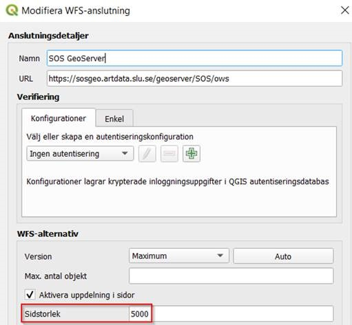

# OGC Web Feature Service (WFS) - Get started guide
All public observations that SOS harvests are available in a OGC Web Feature Service (WFS). This page is a get started guide, for more details see the [SOS WFS technical overview page](WfsService.md).
- [Get started](#get-started)
- [Number of observations returned](#number-of-observations-returned)
- [Known problems](#known-problems)
- [Support](#support)

## Get started
Using a GIS application as ArcGIS or QGIS connect to SOS geoServer by selecting _Add layer_: 

Then add a new connection:

Select _Connect_:

Now select _Swedish species observations_ and select _Add_:

Now species observations are loaded. The default number of observations loaded is 5 000. If you want to get observations for a specific area you can zoom in to that area and press F5 to load observations anew using the current bounding box as a filter.

View details for an observation:

To see the details for an observation select first _Identify object_ and then select the dot for the chosen observation:

Now you can view the details for the observation:

Filter:

All fields can be used to filter the data. For example, if you want to get only observations for Mora municipality then the filter looks like this:

and the result:

You can also combine filters. For example, if you want to get all observations for vascular plants in Mora municipality then you can use as filter: organismGroup = 'Kärlxäxter' AND municipality = 'Mora'. If you instead wnat to get all observations of species classified as exotic in Sweden ('främmande arter' in Swedish) in Mora municipality your filter should look like: isInvasiveInSweden = TRUE AND municipality = 'Mora'.

## Number of observations returned
There is limit allowing only max 5000 observations to be returned for one request, but using paging you can get up to 100 000 observations. To reduce the number of observations per request you can use filters like date, taxa, bounding box, municipality, etc. Using QGIS you need to specify page size (max can be 5000) when you add the new connection. Without this specification you get only a total of max 5000 observations, but specifying page size as a number between, for example, 1000 - 5000 then you can get up to 100 000 observations.

For example, for Trollhättans municipality there are more than 100 000 observations, therefore you need to add a filter to devide the the number of observations between several separate request. For example, you could separate request before and after a specified date: request 1) municipality = 'Trollhättan' AND startDate < '2016-01-01', request 2) municipality = 'Trollhättan' AND startDate > '2015-12-31'. 

## Known problems
The WFS is using [GeoServer](https://geoserver.org/) and a plugin to GeoServer that has a [bug](https://github.com/ngageoint/elasticgeo/issues/122) leading to that requests sometimes stop being processed and no observations are returned until the server is restarted. This problem occurs about once a month. Currently we are restarting GeoServer once a day to try avoid that this problem affects users of the WFS.

## Support
In case of questions or problems, contact support at SLU Artdatabanken: artdatabanken@slu.se
