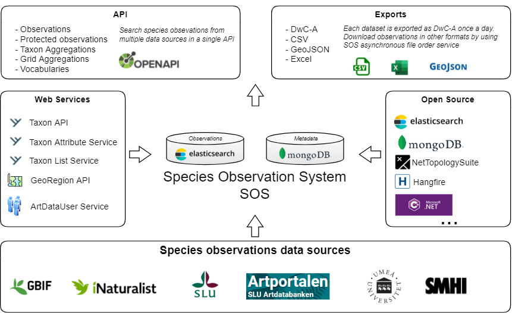

# Species Observation System (SOS)
Species Observation System collects species observations from a number of data sources and gives the user an opportunity to search for those observations using a single API. The system contains over 100 million species observations.

## How do I access the API?
Go to [Artdatabanken developer portal](https://api-portal.artdatabanken.se/) and subscribe to the [Species Observations - multiple data resources](https://api-portal.artdatabanken.se/products/sos) product. Then you will get a description of all endpoints and you will also get an API key to use in your requests.

## API usage documentation
- [Client development](Docs/ClientDevelopment.md)
- [Endpoints](Docs/Endpoints.md)
- [Search filter parameters](Docs/SearchFilter.md)
- [Exports](Docs/Exports.md)
- [Locations](Docs/Locations.md)
- [Authentication](Docs/Authentication.md)
- [Checklists](Docs/Checklists.md)
- [FAQ](Docs/FAQ.md)
- [Web Feature Service (WFS) - Technical overview](Docs/WfsService.md)
- [Web Feature Service (WFS) - Get started guide](Docs/WfsServiceGetStarted.md)
- [Web Map Service (WMS)](Docs/WmsService.md)

## Data types and vocabularies
- [Observation](Docs/Observation.md)
- [Observation (flat structure)](Docs/FlatObservation.md)
- [Field sets](Docs/FieldSets.md)
- [Data providers & dataset](Docs/DataProviders.md)
- [Vocabularies](Docs/Vocabularies.md)
- [Areas](Docs/Areas.md)

## API changes
- [Changelog](CHANGELOG.md)
- [Obsolete properties](Docs/ObsoleteProperties.md)

## Dev documentation
- [How to install SOS on your own machine](Docs/Install.md)
- [How to harvest observations, etc.](Docs/Harvest.md)
