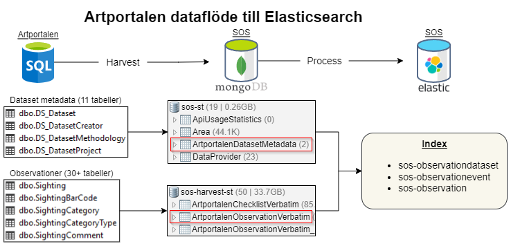
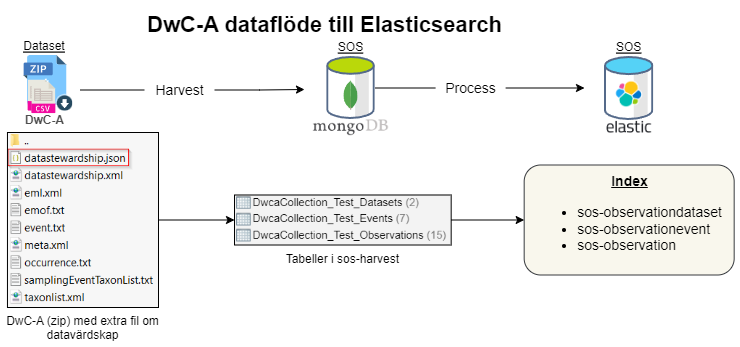
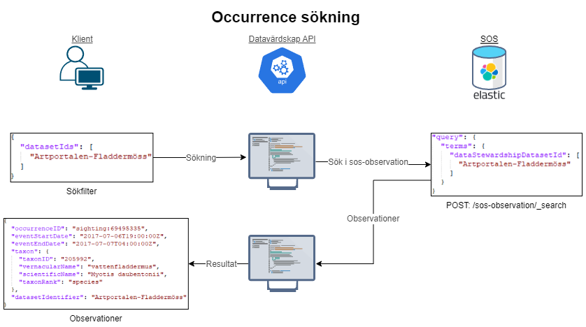
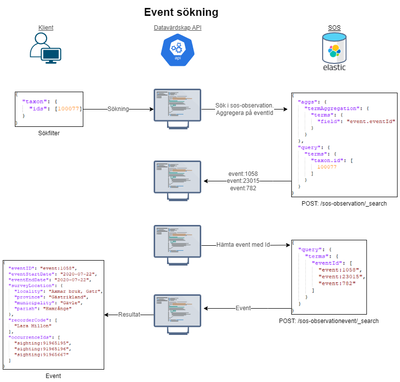
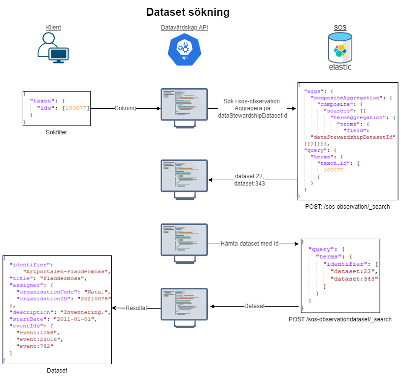

# Datavärdskap

## Dataflöde

### Artportalen
1. Metadata om dataset specificeras i tabeller i Artportalens databas. Tabellerna har prefixet `DS_`.
2. Metadatan skördas till MongoDB och sparas i tabellen **ArtportalenDatasetMetadata**.
3. Under processningen används information från **ArtportalenDatasetMetadata** och **ArtportalenObservationVerbatim** för att skapa följande index i Elasticsearch: 
   - **sos-observationdataset**
   - **sos-observationevent**
   - **sos-observation**.

### DwC-A
1. Extra information om datavärdskap sparas i DwC-A i filen `datastewardship.json` .
2. Vid skördning skapas tre tabeller i MongoDB. En för **Dataset**, en för **Event** och en för **Observationer**.
3. Under processningen används information från **DwcaCollection_Datasets**, **DwcaCollection_Events** och **DwcaCollection_Observations** för att skapa följande index i Elasticsearch: 
   - **sos-observationdataset**
   - **sos-observationevent**
   - **sos-observation**.

## API Sökning

### Occurrence-sökning
1. Sökningen liknar den i SOS Observations API, men med enklare modeller. Sökning görs mot Elasticsearch-indexet **sos-observation**.

### Event-sökning
1. Eftersom Events inte lagrar TaxonId så görs först en aggregering mot indexet **sos-observation** för att få ut **EventId:n** för de observationer som matchar sökningen. Nu används `GetAggregationItemsAsync()`, men eventuellt ska `GetAllAggregationItemsAsync()` för att göra **Composite**-aggregering.
2. En sökning görs mot indexet **sos-observationevent** med de **EventId:n** som returnerades i föregående steg.

### Dataset-sökning
1. Eftersom Datasets inte lagrar TaxonId så görs först en aggregering mot indexet **sos-observation** för att få ut **DatasetId:n** för de observationer som matchar sökningen.
2. En sökning görs mot indexet **sos-observationdataset** med de **DatasetId:n** som returnerades i föregående steg.
